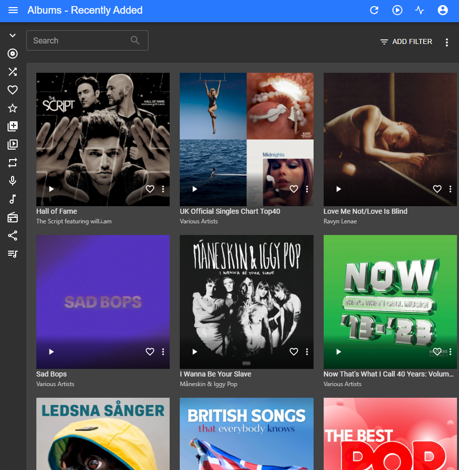

# Fahim's Homelab

A secure, self-hosted infrastructure platform built on Ubuntu Server, Docker Compose, Caddy, and Tailscale.

[](https://github.com/FahimMahmudEkram/fahim-homelab/actions/workflows/preflight.yml)
[](LICENSE)


[Architecture](docs/architecture.md) · [Setup Guide](docs/SETUP.md) · [Security Design](docs/SECURITY.md) · [Screenshots](docs/SCREENSHOTS.md) · [Project Overview](docs/PROJECT-OVERVIEW.md)

## Dashboard

The homelab is organized through a central dashboard for quickly accessing core infrastructure, monitoring, applications, music services, and operational tools.


### Monitoring

Uptime Kuma provides service availability monitoring and gives a centralized view of the homelab's operational health.


### Infrastructure Monitoring

Beszel provides host-level monitoring for CPU, memory, storage, network activity, and system health.


### DNS Filtering

AdGuard Home provides network-wide DNS filtering, query visibility, and blocking of unwanted domains.


### Document Management

Paperless-ngx provides a self-hosted document management system with centralized organization and search.


### Self-Hosted Cloud

Nextcloud provides private cloud storage and file management within the homelab.


### Self-Hosted Music

Navidrome provides a private music streaming and library management service running within the homelab.




## Project at a glance

This homelab consolidates personal cloud, media, document, finance, monitoring, DNS, and password-management services on a single Ubuntu Server while keeping remote access private through Tailscale.

## Quick Start

This repository contains the configuration needed to recreate the homelab on an Ubuntu Server.

```bash
git clone https://github.com/FahimMahmudEkram/fahim-homelab.git
cd fahim-homelab
```

Review the example environment files, adjust host-specific paths and settings, create the required Docker network, and provide secrets through local environment files. Then follow the detailed [Setup Guide](docs/SETUP.md).

## Configuration Matrix

Most of the repository is reusable as-is, but a few values must be customized for each installation. Real secrets should stay in local environment files and must never be committed.

| Area | File | Customize | Secret? |
|---|---|---|---|
| Reverse proxy | `caddy/Caddyfile` | Replace the example hostname and any LAN/Tailscale backend addresses | No |
| Host inventory | `inventory.yaml` | Server name, network details, storage paths, and hardware-specific values | No |
| Nextcloud | `nextcloud/db.env.example` | `POSTGRES_PASSWORD` for the database | Yes |
| Nextcloud | `nextcloud/compose.yml` | Trusted domain, external hostname, proxy settings, and `/mnt/data` storage path | No |
| Immich | `immich/.env.example` | `UPLOAD_LOCATION`, `DB_DATA_LOCATION`, `TZ`, `IMMICH_VERSION`, `DB_PASSWORD` | `DB_PASSWORD` |
| Paperless-ngx | `paperless/docker-compose.env.example` | UID/GID, `PAPERLESS_SECRET_KEY`, `PAPERLESS_DBPASS`, time zone, and public URL | Secret key + DB password |
| Paperless-ngx | `paperless/.env.example` | Deployment values used by Paperless-ngx | Secret key + DB password |
| Firefly III | `firefly/.env.example` | Owner email, `APP_KEY`, database password, optional Redis/SMTP credentials, OAuth key, cron token, and `APP_URL` | Several values |
| Firefly III | `firefly/.db.env.example` | Database password and database identity if changed | `MYSQL_PASSWORD` |
| Navidrome | `navidrome/compose.yml` | `ND_BASEURL`, music-library path, Last.fm credentials | Last.fm credentials |
| Beszel | `beszel/compose.yml` | `BESZEL_TOKEN` and host-specific disk/device mappings | `BESZEL_TOKEN` |
| Homepage | `homepage/config/*` | Service URLs, labels, widgets, and integrations | Depends on integration |
| Feishin | `feishin/compose.yml` | Review service URL and host-specific settings | Usually no |
| Uptime Kuma | `uptime-kuma/compose.yml` | Review host paths and networking | Usually no |
| AdGuard Home | `adguard/compose.yml` | Review ports, volumes, and host-specific networking | Depends on live config |
| Vaultwarden | `vaultwarden/compose.yml` | Review persistent storage, hostname, and deployment settings | Depends on deployment |
| Docker network | All Compose files | Create the shared external `proxy` network before deployment | No |

### Secret vs. configuration

**Secret values** should be generated independently for every installation. Examples include database passwords, application secret keys, OAuth/private keys, API credentials, and service tokens.

**Configuration values** such as hostnames, mount paths, time zones, UID/GID values, Docker device names, and storage locations normally need to be changed when moving the project to another server.

The repository intentionally provides `*.example` files as templates. Copy them to local files, fill in the real values, and keep those local files out of Git.

## Service Catalog

| Service | Purpose |
|---|---|
| Homepage | Central dashboard for homelab services and operational links |
| Caddy | HTTPS reverse proxy and service routing |
| Tailscale | Private remote network access |
| Uptime Kuma | Service availability monitoring |
| Beszel | Host-level resource and system monitoring |
| AdGuard Home | Network-wide DNS filtering |
| Nextcloud | Private cloud storage and file management |
| Immich | Self-hosted photo and video management |
| Paperless-ngx | Document management and search |
| Vaultwarden | Self-hosted password management |
| Firefly III | Personal finance management |
| Navidrome | Self-hosted music streaming |
| Feishin | Web client for the music library |

### Highlights

- **Containerized services** using Docker Compose.
- **Single reverse-proxy layer** with Caddy and HTTPS.
- **Private remote access** through Tailscale rather than router port forwarding.
- **Service monitoring** with Uptime Kuma and Beszel.
- **Network-wide DNS filtering** with AdGuard Home.
- **Self-hosted applications** including Nextcloud, Immich, Paperless-ngx, Vaultwarden, Firefly III, Navidrome, and Feishin.
- **Persistent storage** split across dedicated disks for different workloads.
- **Automatic OS security updates** while keeping application/image updates under manual control.
- **Configuration-as-code** with documentation and a machine-readable inventory.
- **Operational documentation** generated automatically from the README source.

## Architecture

```mermaid
flowchart TB
    U["Laptop / Phone / Tablet"]
    LAN["Home LAN<br/>192.168.1.0/24"]
    TS["Tailscale private network"]
    C["Caddy<br/>HTTPS reverse proxy"]

    subgraph H["Ubuntu Server • fahim"]
      C
      subgraph P["Docker proxy network"]
        HP["Homepage"]
        ND["Navidrome"]
        FE["Feishin"]
        PA["Paperless-ngx"]
        NC["Nextcloud"]
        IM["Immich"]
        FF["Firefly III"]
        VW["Vaultwarden"]
        UK["Uptime Kuma"]
        BZ["Beszel"]
        AG["AdGuard Home"]
      end
      ST["Persistent storage<br/>/mnt/music • /mnt/data • /mnt/immich"]
    end

    U --> LAN
    U --> TS
    LAN --> C
    TS --> C

    C --> HP
    C --> ND
    C --> FE
    C --> PA
    C --> NC
    C --> IM
    C --> FF
    C --> VW
    C --> UK
    C --> BZ
    C --> AG

    ND --> ST
    NC --> ST
    IM --> ST
    PA --> ST
