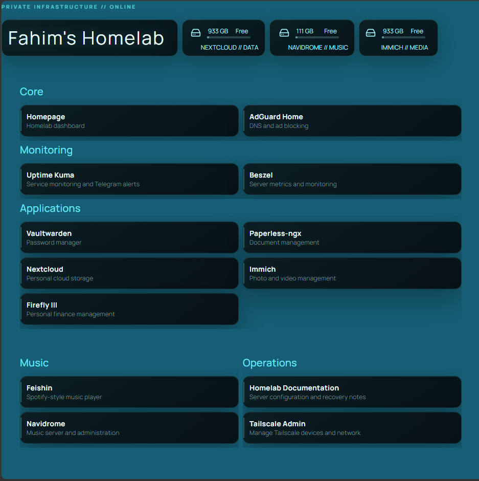
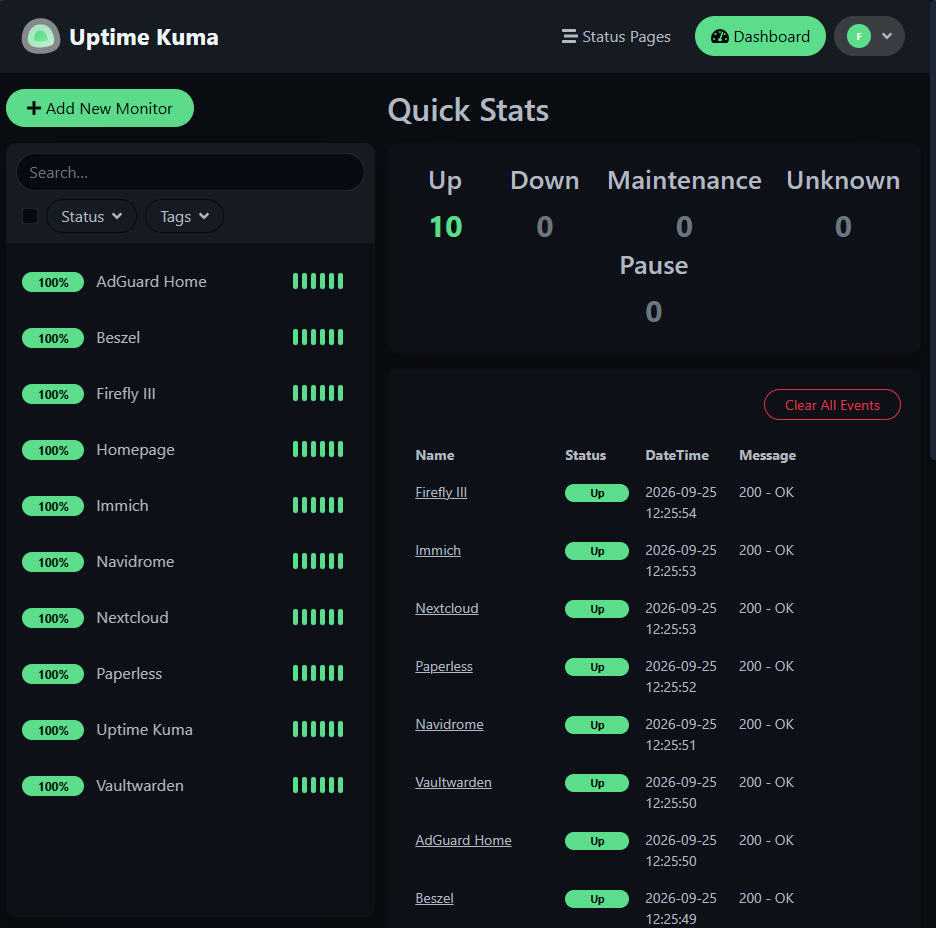
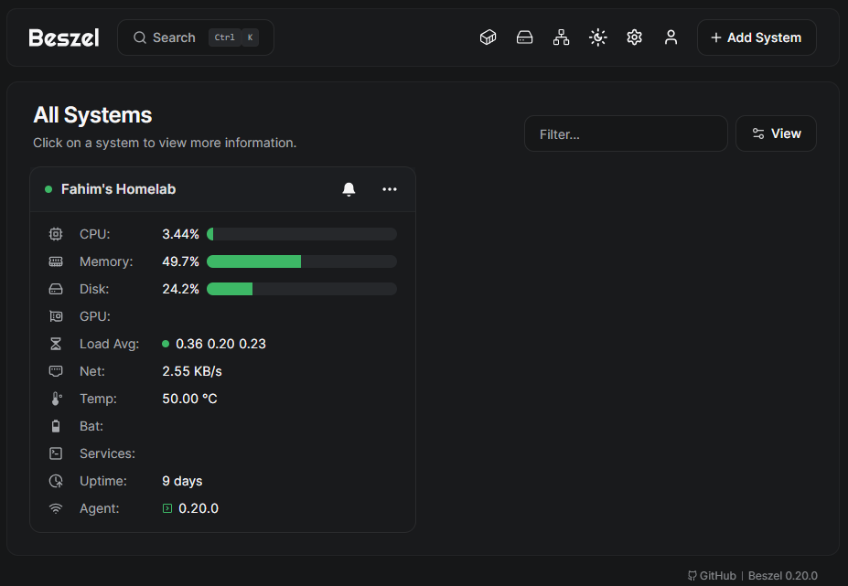
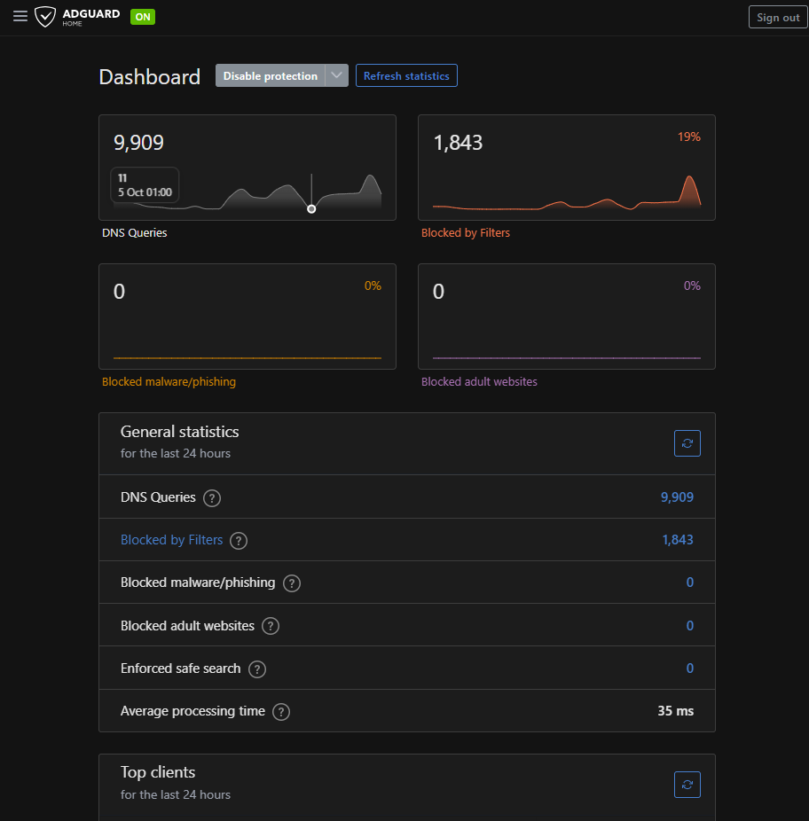
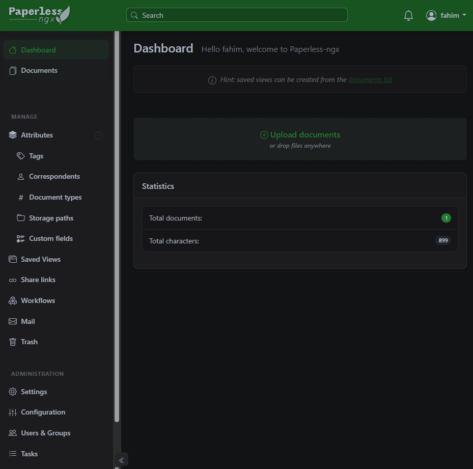
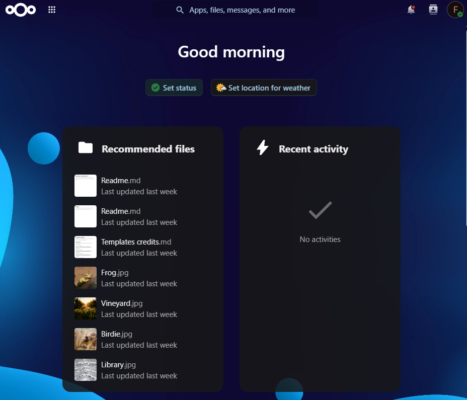

# Fahim's Homelab

A secure, self-hosted infrastructure platform built on Ubuntu Server, Docker Compose, Caddy, and Tailscale.


[Architecture](docs/architecture.md) · [Setup Guide](docs/SETUP.md) · [Security Design](docs/SECURITY.md) · [Screenshots](docs/SCREENSHOTS.md) · [Project Overview](docs/PROJECT-OVERVIEW.md)

## Dashboard

The homelab is organized through a central dashboard for quickly accessing core infrastructure, monitoring, applications, music services, and operational tools.



### Monitoring

Uptime Kuma provides service availability monitoring and gives a centralized view of the homelab's operational health.



### Infrastructure Monitoring

Beszel provides host-level monitoring for CPU, memory, storage, network activity, and system health.



### DNS Filtering

AdGuard Home provides network-wide DNS filtering, query visibility, and blocking of unwanted domains.



### Document Management

Paperless-ngx provides a self-hosted document management system with centralized organization and search.



### Self-Hosted Cloud

Nextcloud provides private cloud storage and file management within the homelab.




## Project at a glance

This homelab consolidates personal cloud, media, document, finance, monitoring, DNS, and password-management services on a single Ubuntu Server while keeping remote access private through Tailscale.

### Highlights

- **Containerized services** using Docker Compose.
- **Single reverse-proxy layer** with Caddy and HTTPS.
- **Private remote access** through Tailscale rather than router port forwarding.
- **Service monitoring** with Uptime Kuma and Beszel.
- **Network-wide DNS filtering** with AdGuard Home.
- **Self-hosted applications** including Nextcloud, Immich, Paperless-ngx, Vaultwarden, Firefly III, Navidrome, and Feishin.
- **Persistent storage** split across dedicated disks for different workloads.
- **Automatic OS security updates** while keeping application/image updates under manual control.
- **Configuration-as-code** with documentation and a machine-readable inventory.
- **Operational documentation** generated automatically from the README source.

## Architecture

```mermaid
flowchart TB
    U["Laptop / Phone / Tablet"]
    LAN["Home LAN<br/>192.168.1.0/24"]
    TS["Tailscale private network"]
    C["Caddy<br/>HTTPS reverse proxy"]

    subgraph H["Ubuntu Server • fahim"]
      C
      subgraph P["Docker proxy network"]
        HP["Homepage"]
        ND["Navidrome"]
        FE["Feishin"]
        PA["Paperless-ngx"]
        NC["Nextcloud"]
        IM["Immich"]
        FF["Firefly III"]
        VW["Vaultwarden"]
        UK["Uptime Kuma"]
        BZ["Beszel"]
        AG["AdGuard Home"]
      end
      ST["Persistent storage<br/>/mnt/music • /mnt/data • /mnt/immich"]
    end

    U --> LAN
    U --> TS
    LAN --> C
    TS --> C

    C --> HP
    C --> ND
    C --> FE
    C --> PA
    C --> NC
    C --> IM
    C --> FF
    C --> VW
    C --> UK
    C --> BZ
    C --> AG

    ND --> ST
    NC --> ST
    IM --> ST
    PA --> ST
