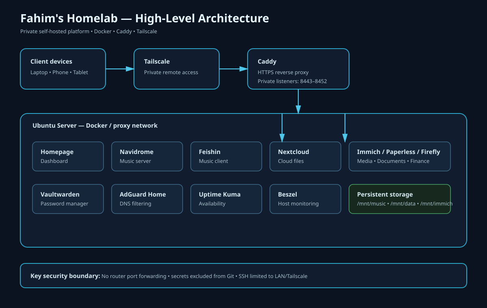

# Project Screenshots

This page provides visual examples of the homelab's dashboards and operational tooling.

## Homepage Dashboard

The central dashboard organizes infrastructure, monitoring, applications, music services, and operational tools.

## Uptime Kuma

Service availability monitoring and health status across the homelab.

## Beszel

Host-level monitoring for CPU, memory, storage, network activity, and system health.

## AdGuard Home

Network-wide DNS filtering, query visibility, and blocking statistics.

## Paperless-ngx

Self-hosted document management and organization.

## Architecture

The system architecture showing the private access layer, reverse proxy, Docker services, persistent storage, and monitoring components.

> Screenshots are sanitized for public documentation. No passwords, tokens, private keys, databases, backups, or other sensitive runtime data are included in this repository.
